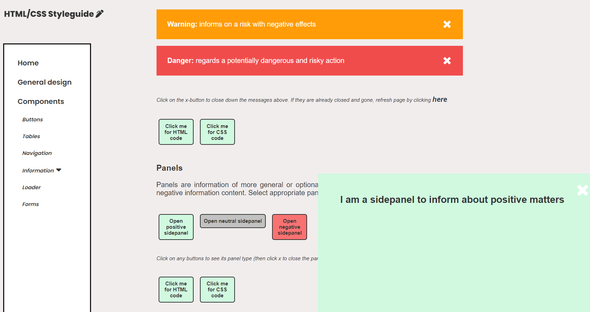

### HTML/CSS Styleguide

#### Description 
A styleguide with common html/css components. For future usage, eases copy paste of own codes and enables coherent design. 

<!-- #+html: 

 -->

#### Purpose & Motivation
This started of as part of a school assignment. 
Main purpose is to imporove html and css skills. 

#### Used tech
- HTML/CSS
- Javascript for displaying component's html/css code 
- Github pages for published of website

##### Visit published webpage:
https://osho81.github.io/htmlcss-styleguide/  
